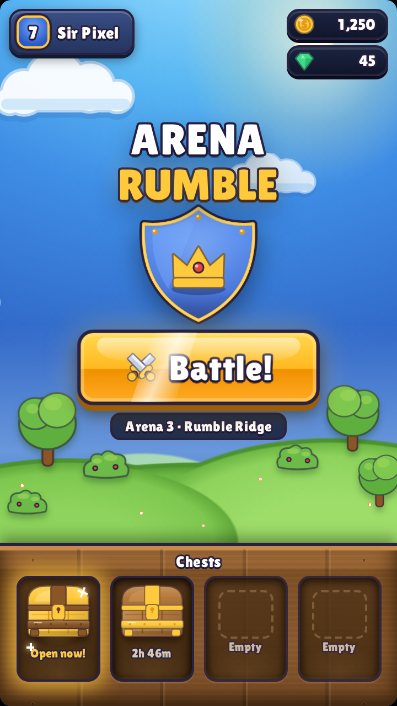
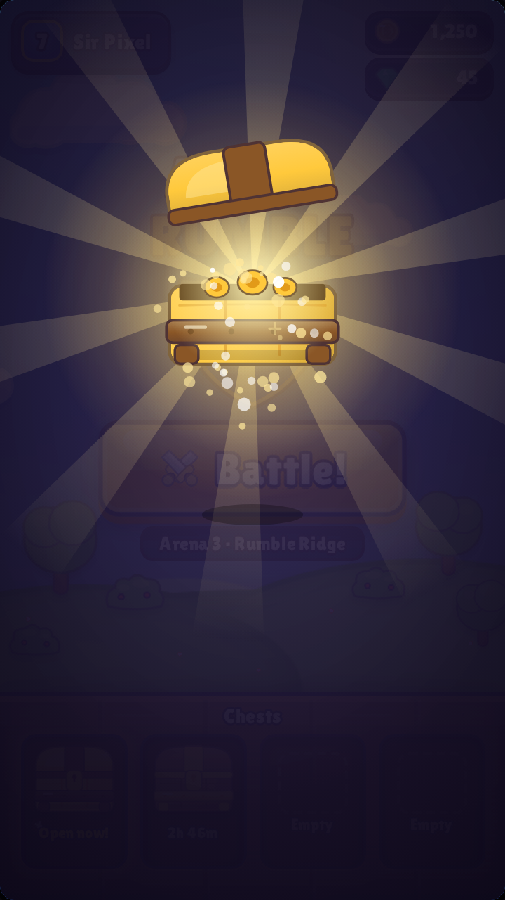
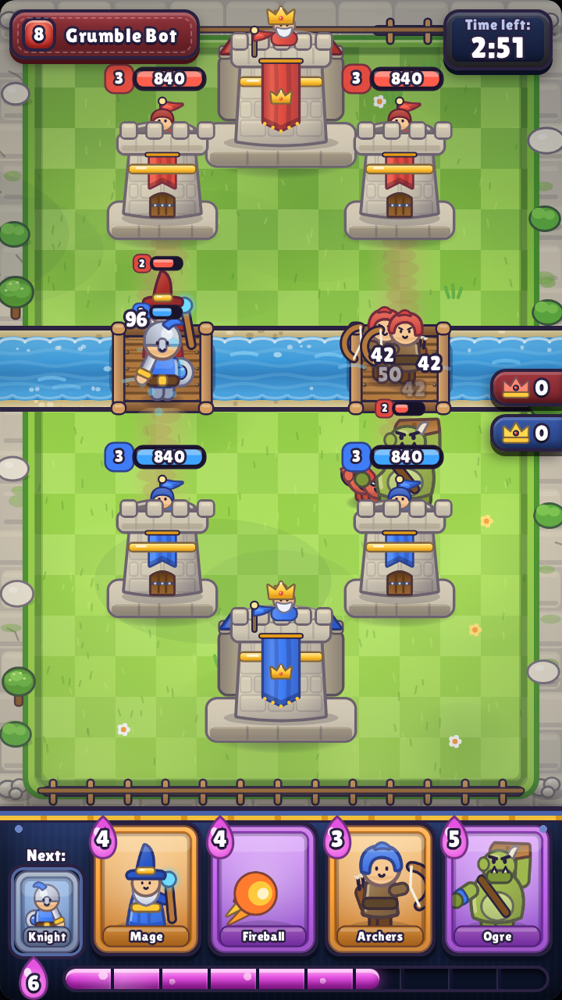
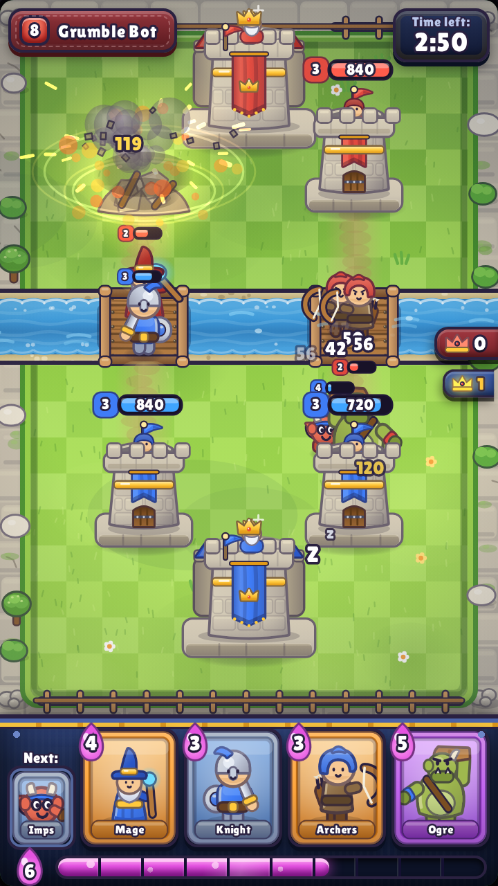
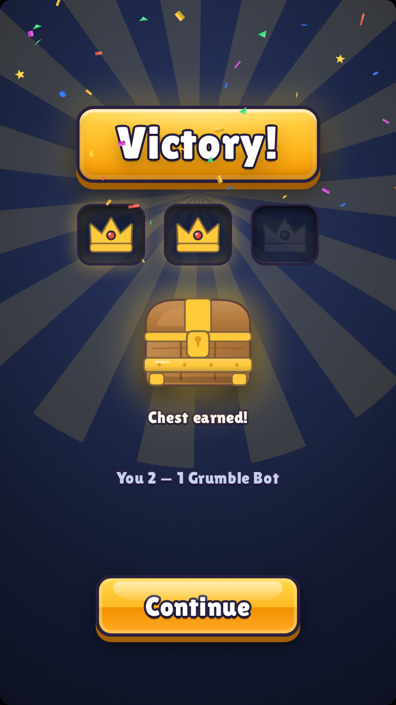

# Arena Rumble

A playable browser demo of a mobile-style arena card battler: a home/chest screen and a
real-time two-lane tower battle, connected in a full game loop
(`HOME → CHEST_OPENING → HOME → BATTLE → RESULT → HOME`).

Private, non-commercial study project. **Every asset is original** — all sprites, UI
chrome, arena art, and effects are drawn procedurally with the Canvas 2D API at runtime,
and all sound effects are synthesized with WebAudio. No third-party game assets of any
kind are included or referenced.

## Run it

```bash
python3 -m http.server 8360
# then open http://localhost:8360
```

Any static file server works — there is no build step, no framework, no runtime
dependency. Plain HTML/CSS/JS with ES modules (`index.html` + `src/`).

**No server at all?** Use the single-file build: [`dist/arena-rumble.html`](dist/arena-rumble.html)
bundles the CSS, all six modules, and the font into one self-contained page that runs
from a plain double-click (`file://`). Rebuild it after source changes with
`node tools/build-single.js`; smoke-test it with `node tools/check-single.js`.

## Controls

- **Home** — tap the glowing chest to open it (3 taps pops the lid), or hit **Battle!**
- **Battle** — tap a card, then tap your half of the arena to deploy (or drag the card
  onto the field). Fireball can be thrown anywhere. 3:00 timer; elixir regenerates
  (1 per 2.8 s, cap 10, ×1.5 in the last minute).
- Destroying a side tower earns a crown; destroying the king tower wins instantly.
  At 0:00 the side with more crowns wins.
- **Result** — a win drops a reward chest into an empty home slot.

## Final screenshots

| HOME | CHEST | BATTLE |
|---|---|---|
|  |  |  |

| TOWER DOWN | RESULT |
|---|---|
|  |  |

## Project layout

```
index.html        app shell (360×640 stage, letterboxed, scaled to fit)
styles.css        UI chrome: home, chest overlay, battle HUD, result
src/
  main.js         state machine, screens, chest opening, HUD wiring, game loop
  battle.js       battle sim (units, towers, targeting, AI) + arena canvas renderer
  art.js          procedural sprite kit (towers, 5 unit types, chests, cards, icons)
  data.js         unit/card/tower stats and game rules
  audio.js        WebAudio-synthesized SFX (tap, deploy, hit, explosion, fanfare)
  util.js         math/DOM helpers, seeded RNG
assets/fonts/     Lilita One (bundled locally from Google Fonts, OFL license)
tools/
  capture.js      Playwright harness: drives the game into 5 canonical states -> PNGs
  e2e.js          Playwright smoke test: full loop via real UI interaction
artifacts/        iter-01…15 + realism-01…20: screenshots + notes.md per pass
```

## Dev workflow

Playwright (with headless Chromium) is the only dev dependency, used exclusively for
screenshots and the smoke test:

```bash
npm install                      # installs playwright
npx playwright install chromium  # fetches the browser once

node tools/capture.js artifacts/my-run   # capture the 5 canonical states
node tools/e2e.js                        # full-loop smoke test, asserts zero console errors
```

The game exposes a small `window.__game` hook (goto state, fast-forward the sim, direct
battle access) so captures are deterministic.

## The 15-iteration visual loop

The demo was refined through 15 structured iterations. Each `artifacts/iter-NN/` folder
contains the five state captures taken before the iteration's fixes, a `notes.md` with
rubric scores (layout fidelity, sprite quality, palette cohesion, readability,
game-feel, overall impression) and the five most damaging visual problems, plus
`after-*.png` re-captures verifying the fixes landed. Highlights:

- 01–03: chest geometry, king tower fit, overhead UI pass, arena depth and unit scale
- 04–06: damage-only HP bars, impact stars, elixir bar feedback, tower muzzle flashes
- 07–09: tower defenders, squad formations, bigger hand cards, victory confetti
- 10–12: proportional card portraits, stacked damage numbers, corpse fades, living water
- 13–15: ground deploy rings, melee lunges, scalloped waterline, CTA sheen, lit crown counters

## The 20-pass realism upgrade

A second phase (`artifacts/realism-01…20/`, one notes.md per pass) pushed the rendering
from flat vector toward a lit, volumetric look — still 100% original procedural art:

- 01–04 environment: textured turf (gradient, mottling, 330 blade strokes, AO), staggered
  slab border with corner boulders and moss, banded water depth with foam and caustics,
  plank-built bridges with grain, nails and capped rails
- 05–07 towers: per-brick masonry with mortar and bevels, cylindrical wall light, blocky
  platforms, dimensional merlons, draped cloth banners with folds and gold fringe,
  recessed doors with iron hardware, jeweled crown emblem
- 08–09 troops: shared lighting language on all five units — key-light gradients,
  rim strokes, domed steel speculars, cloth folds
- 10–11 effects: additive (`lighter`) projectile glows with ghost/ember trails, arrow
  motion streaks, ground shockwave rings, guttering ember sparks, fading scorch decals
- 12–14 battle UI: beveled card frames with portrait stage light, brushed HUD tray,
  liquid elixir bar (meniscus, bubbles, travelling sheen), satin name plate, glassy timer
- 15–19 meta screens: sun bloom + parallax hill haze, forged shield emblem with gold
  piping and rivets, chest volume + additive burst bloom, recessed shelf cubbies,
  beveled result banner and six-shape confetti
- 20: full-frame light grade (warm key upper-left, cool falloff lower-right) unifying
  every sprite, plus rebuilt single-file dist and green e2e/smoke checks
- 21–25 style shift: universal ink outlines replaced with per-material soft edges
  (the "sticker -> rendered" lever), feathered contact shadows and +5% troop scale,
  crisper saturated turf, plateau drop shadow with sunlit lip, border trees, hollow
  turret mouths and keep platform floors, final re-ship with green checks
