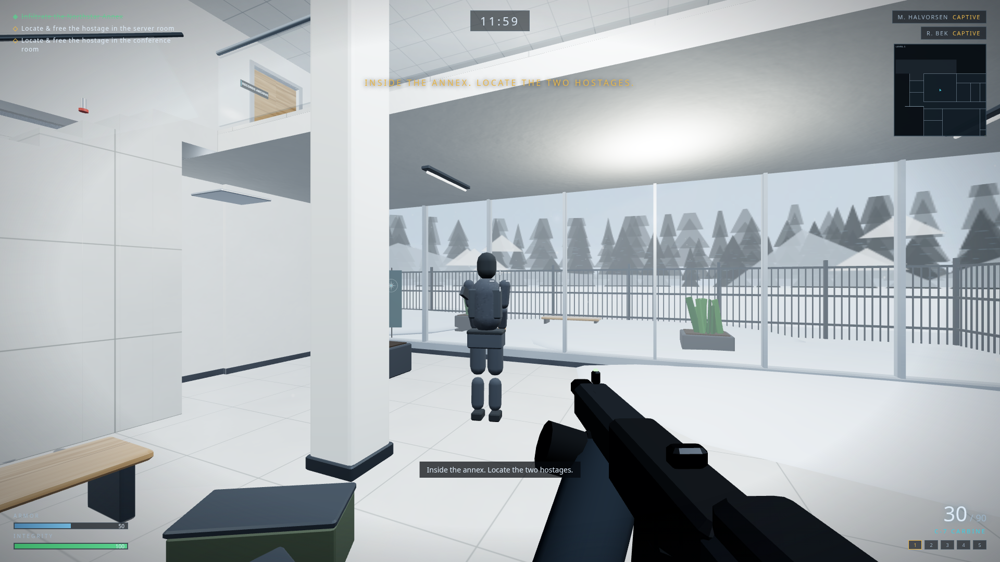

# NORTHSTAR RESCUE

An original single-player **tactical first-person shooter** vertical slice set in a
snowbound corporate office — the *Northstar Administrative Annex* of the fictional
**Norrsken Dynamics**. Locate two hostages held by the Kestrel Cell, free them, and
escort them to the extraction garage before the storm window closes.

Built entirely with web technology: **Three.js (WebGL2) + TypeScript + Vite**, DOM
overlay UI, WebAudio-synthesized sound. **Every texture, model, sound and interface
graphic is generated procedurally from code** — the repository contains no binary
media, and nothing is copied from Counter-Strike, Valve, or any other game.



## Quick start

```bash
npm install
npm run dev          # → http://localhost:5173
```

Production build: `npm run build` then `npm run preview`.

Requires a Chromium-based browser (Chrome/Edge/Brave). Playable at 1920×1080; quality
presets (Low → Ultra) and a resolution-scale slider support weaker hardware.

## Controls

| Action | Key |
|---|---|
| Move | `W A S D` |
| Look / fire / aim | Mouse / `LMB` / `RMB` |
| Slow walk (quiet) | `Shift` |
| Crouch (toggle) | `C` or `Ctrl` |
| Jump | `Space` |
| Interact (doors, hostages) | `E` |
| Reload | `R` |
| Weapons | `1` primary · `2` sidearm · `3` blade · `4` flash · `5` smoke |
| Pause | `Esc` |
| Fullscreen | `F` (Esc exits) |

Detailed control reference and mission intel live in the in-game **Controls** and
**Briefing** screens.

## Mission flow

Title → Settings/Controls → Difficulty (Recruit / Operator / Veteran) → Briefing →
Loadout → Insertion at the snowbound employee entrance → infiltrate the annex →
free **M. Halvorsen** (server room) and **R. Bek** (conference room, level 2) →
escort both to the **extraction garage** → hold until the shutter opens → extraction.
Defeat on operator death, hostage death, or mission-timer expiry. Restart and
return-to-menu are always available from the pause and end screens.

## Testing & automation

```bash
npm test             # full Playwright matrix (drives system Chrome, headless)
npm run manifest     # regenerate docs/asset-manifest.md from the runtime registry
node tools/shot.mjs --checkpoint lobby --out shot.png   # ad-hoc screenshot probe
node tools/gallery-sweep.mjs                             # capture all asset exhibits
```

Deterministic hooks (test mode `?test=1`):

- `window.render_game_to_text()` — canonical JSON state snapshot (player, weapon,
  mission, hostages, enemies, doors, interactables, outcome, perf).
- `window.advanceTime(ms)` — advance the fixed-timestep simulation deterministically.
- `window.__qa` — dev/QA API: teleport to named checkpoints, weapon select, enemy
  spawn/kill/freeze, lighting scenarios, mission state shortcuts, asset gallery,
  collision/nav visualization.

Useful URL parameters: `?test=1` (deterministic mode) · `?seed=N` · `?graybox=1` ·
`?qa=1` · `?quality=low|medium|high|ultra` · `?mode=playing&difficulty=veteran&loadout=br8`.

## Documentation

| Document | Purpose |
|---|---|
| `docs/architecture.md` | Locked technical stack, module graph, simulation model |
| `docs/progress.md` | Original project prompt (verbatim) + full progress log |
| `docs/ownership-ledger.md` | Eight-agent ownership areas & dispatch log |
| `docs/asset-manifest.md` | Generated manifest of every registered asset |
| `docs/visual-bible.md` | Fiction, color script, shape language, lighting plan |
| `docs/playwright-scenarios.md` | Automation scenario checklist |
| `docs/known-issues.md` | Live issue list |
| `docs/screenshot-index.md` | Evidence index & repeatable camera list |

## Originality statement

All code, layouts, models, textures, sounds, names, logos and UI in this repository
are original works created for this project. No Counter-Strike or Valve assets, maps,
sounds, or branding were copied or referenced as data. The map is an original
two-story design that shares no footprint or adjacency graph with `cs_office`.
