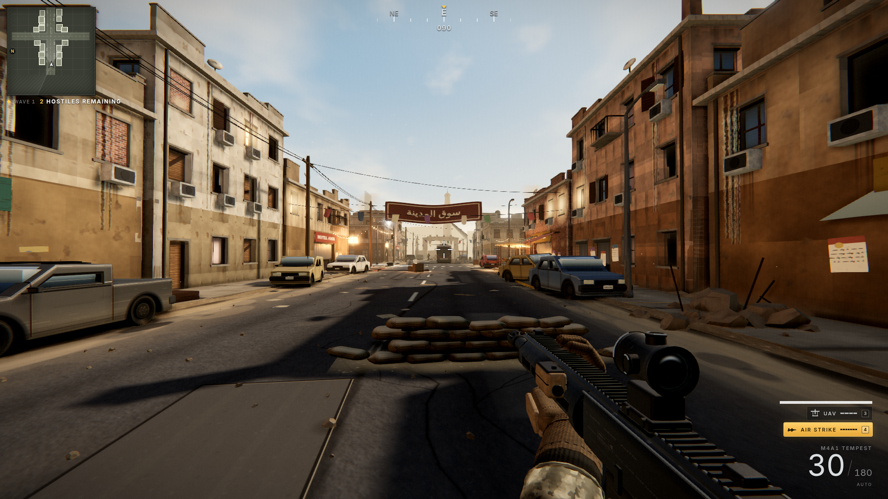

# STRIKEFORCE: Dust Line

A AAA-styled first-person shooter built entirely in **Three.js** — no game engine, no external assets. Every texture, model, sound, and effect is generated procedurally at load time. The art target is the desert-city street combat of recent Call of Duty titles: a sun-bleached market street, wrecked vehicles, layered smoke and fire, a mil-spec HUD, and close air support on call.



## Quick start

```bash
npm install
npm run dev       # http://localhost:5173
npm run build     # production build to dist/
npm run preview   # serve the production build
```

## Playing

You are Sgt. Vance, holding a market street against waves of hostiles.

| Input | Action |
|---|---|
| W A S D | Move |
| SHIFT | Tactical sprint |
| Mouse | Aim / LMB fire / RMB aim down sights |
| R | Reload |
| 1 / 2 | Rifle / sidearm |
| SPACE | Jump / vault |
| C | Crouch / slide |
| G | Frag grenade |
| 3 | UAV sweep (4-kill streak) — live enemy pings on the minimap |
| 4 | **Air strike** (7-kill streak) — opens the CAS-9 targeting tablet; LMB designates the grid square, then a jet pair rolls in and lays a stick of bombs down the street |
| ESC | Pause |

## What's inside

- **Rendering** — three.js WebGL2 with a full post chain: GTAO, dual-camera viewmodel pass, UnrealBloom, ACES tone mapping, SMAA, and a military film grade (warmth, vignette, grain, chromatic aberration, blast-concussion pulse).
- **World** — a procedurally dressed desert market street: parametric buildings with recessed windows, AC units, posters and water stains; baked road overlays (lane paint, tar snakes, manholes, oil); sandbag emplacements, wrecked buses and cars with lathed wheels and baked panel skins; laundry lines, string lights, market stalls that react to blast waves.
- **Weapons** — procedural rifle/pistol viewmodels with articulated hands, red-dot collimation across cameras, layered muzzle flash, brass ejection with glints, tracers, sub-stepped particle trails, and full recoil/sway/bob/ADS state machines.
- **AI** — enemy soldiers with A* navigation, cover selection, combat states, quaternion aim solving, three weapon-carry templates, CQB threat mounting, flinches, and procedural body/face/gear variation.
- **Killstreaks** — UAV minimap sweep and the CAS-9 air strike: a hand-held targeting tablet (live satellite map rendered from the actual scene), jet flybys, staggered bomb sticks, shockwaves, debris, and building-scale smoke columns.
- **Audio** — fully synthesized WebAudio SFX: gunshots with tails, explosions with sub-bass, jet flybys, footsteps by surface, UI ticks, ambient wind.
- **HUD/UI** — compass tape, canvas minimap, killfeed, hitmarkers, damage vignette, killstreak widgets, and a full menu flow (deploy / briefing / settings / pause / death).

## Screenshot harness

Deterministic photo-mode scenarios drive automated captures for visual review:

```bash
npm run shots                         # captures all 8 scenarios to screenshots/
node tools/screenshot.mjs ads menu    # capture a subset
```

Scenarios: `vista`, `combat`, `ads`, `enemies`, `airstrike`, `airstrike2`, `tablet`, `menu`. The harness boots (or reuses) the Vite dev server and drives headless Chrome via `playwright-core` with SwiftShader WebGL, so it runs on machines without a GPU. `PORT` and `OUT` environment variables override the server port and output directory.

## Project layout

```
src/
  core/       engine (renderer + post chain), input, procedural audio, math/nav
  world/      map assembly, building factory, procedural PBR textures, sky/sun, props
  weapons/    viewmodel meshes, weapon state machines
  ai/         enemy soldiers: models, animation, combat AI
  fx/         particle pools, explosions, tracers, decals
  killstreaks/ UAV + air strike (tablet UI, jets, bombs)
  player/     movement controller
  ui/         HUD, menus, styles
  photo/      deterministic photo-mode staging for the screenshot harness
tools/        screenshot.mjs headless capture harness
```
