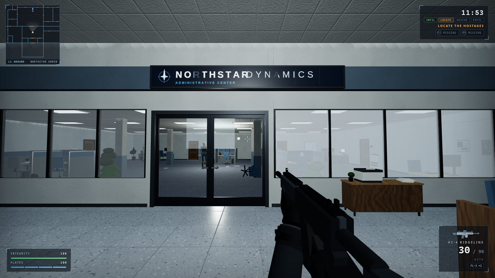

# NORTHSTAR RESCUE

A single-player tactical first-person shooter that runs in your browser.
A blizzard, a seized corporate headquarters, two hostages, one operator.

Original game — all code, art, audio, names and branding are created from
scratch in this repository (no Counter-Strike/Valve or other third-party
assets; see `docs/originality-statement.md`).



## Run it

```bash
npm install
npm start          # → http://127.0.0.1:5173  (Chromium-based browser recommended)
```

That's the one command. No other services, accounts or downloads.

## Controls

| Input | Action |
|---|---|
| W A S D | Move |
| Mouse | Look / aim (click the game view to capture the mouse) |
| Left click | Fire / throw gadget |
| Right click (hold) | Aim down sights |
| Shift (hold) | Walk quietly |
| C / Ctrl | Crouch |
| Space | Jump / vault low obstacles |
| R | Reload |
| E | Interact — doors, hostages, pickups |
| 1 / 2 / 3 / 4 | Primary / sidearm / knife / gadget |
| Mouse wheel | Cycle weapons |
| G | Quick-throw gadget |
| F | Toggle fullscreen (Esc exits) |
| Esc | Pause / release mouse |

## Mission

Infiltrate the **Northstar Administrative Center**, locate **Dr. Elin Voss**
and **Marcus Reid**, free them (E), escort them — together or one at a time —
to the extraction van in the underground garage, and get everyone out before
the storm cover expires.

- Freed hostages follow you; press E again to make them hold or resume.
- Walking (Shift) and crouching keep your noise profile down; carpet is
  quieter than tile. Hostiles investigate what they hear.
- Interior glass breaks — loudly. Smoke breaks sightlines; flash blinds
  everything with eyes, including yours.

## Testing / QA

```bash
npm test               # Playwright suite (starts its own server)
npm run shot           # one-off screenshot + state probe (tools/shot.mjs)
```

Deterministic hooks (see `docs/architecture.md`):
`window.render_game_to_text()`, `window.advanceTime(ms)`, and a dev-only
`window.__qa` API behind `?qa=1` (teleports, weapon select, AI freeze,
lighting scenarios, asset gallery, collision/nav overlays).

## Documentation

- `docs/architecture.md` — locked stack + module graph
- `docs/ownership-ledger.md` — team ownership & working rules
- `docs/asset-manifest.md` + `assets/manifest/` — asset registry
- `docs/playwright-scenarios.md` — test matrix
- `docs/final-checklists.md` — room-by-room + weapon + character sign-off
- `docs/screenshot-index.md` — curated evidence (graybox → final)
- `docs/perf-summary.md` — draw-call/triangle/frame budgets and measurements
- `docs/originality-statement.md` — no third-party or Counter-Strike assets
- `docs/visual-quality-checklist.md`, `docs/known-issues.md`, `progress.md`
