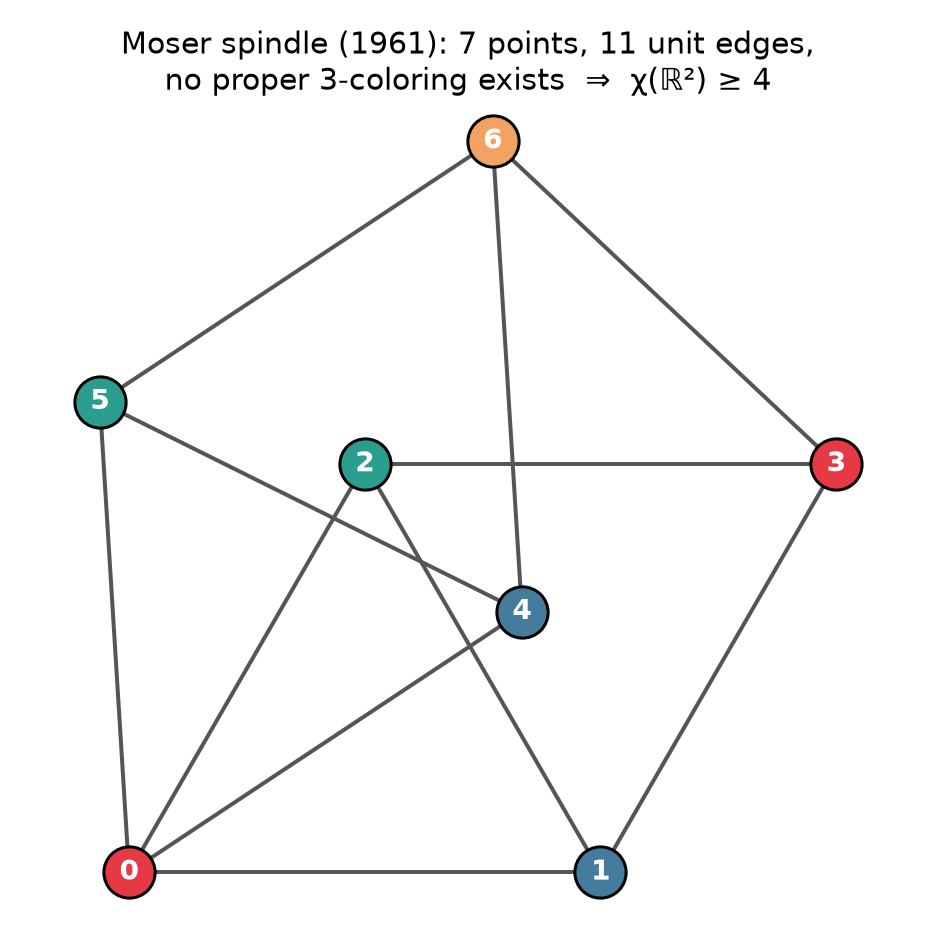
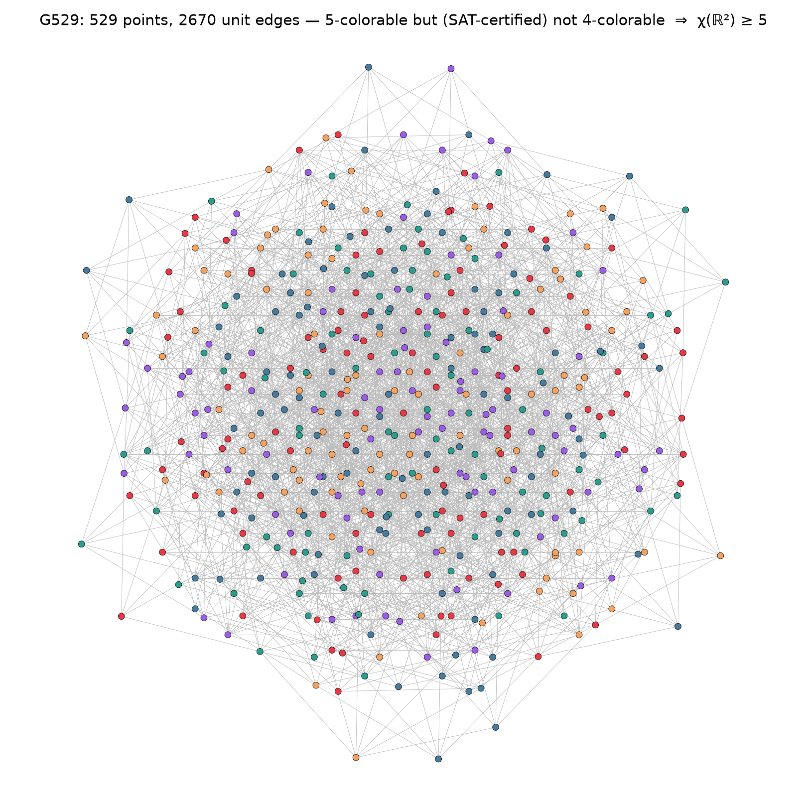
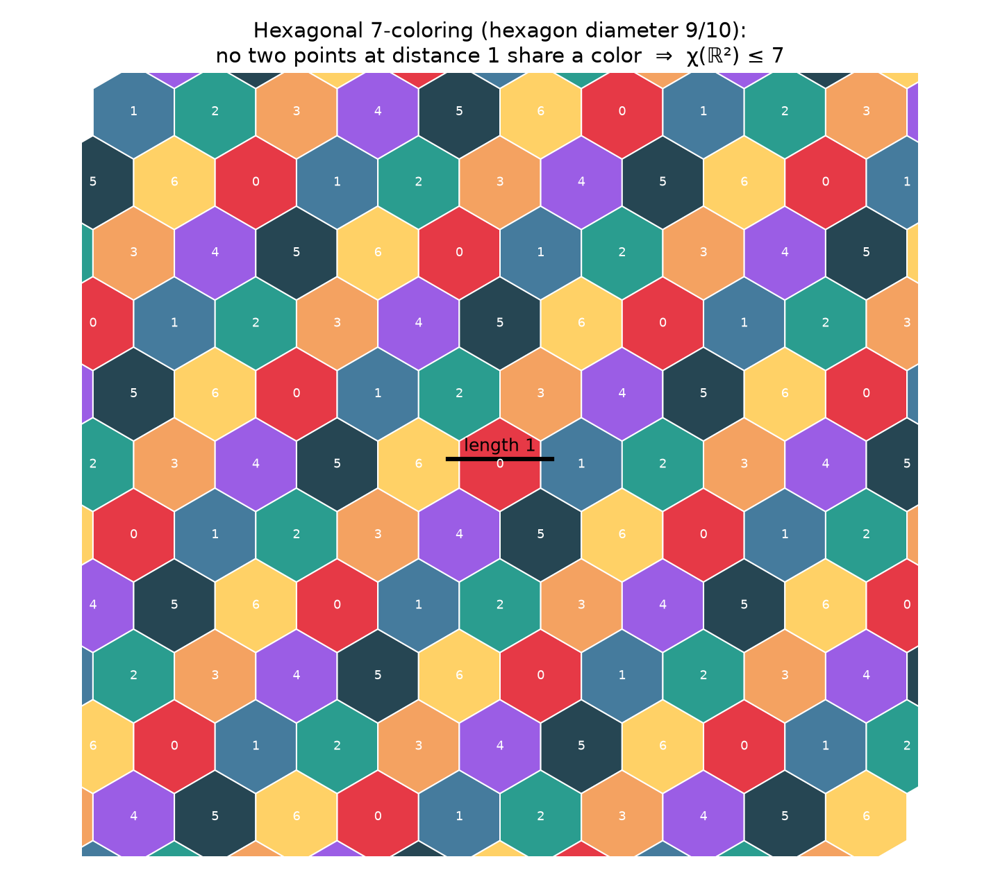

# Hadwiger–Nelson: the chromatic number of the plane

> **Task:** "solve this while i go to popeyes"
>
> **Status report:** the problem has been open since ~1950 and remains open —
> no chicken-sandwich-length window was going to change that. What this repo
> delivers instead is the next best thing: **machine-verified certificates of
> everything humanity actually knows about it**, reproducible on your machine:
>
> **5 ≤ χ(ℝ²) ≤ 7**, with nothing taken on faith.

## The problem

Color every point of the plane so that no two points at distance exactly 1
get the same color. How many colors do you need? That minimum is the
*chromatic number of the plane*, χ(ℝ²). Edward Nelson asked the question in
1950; Hugo Hadwiger's name is attached via the closely related tiling work
that produced the upper bound. It is Problem #1 in the field of geometric
graph coloring, and after 75 years the answer is only known to be
**5, 6, or 7**.

## What is certified here

`verify.py` establishes the two best known bounds from raw data, end to end:

| Certificate | Method | Result |
|---|---|---|
| χ(ℝ²) ≥ 4 | Moser spindle: 7 exact points; its 11 unit edges are *recomputed* from the coordinates in exact arithmetic; all 3⁷ = 2187 assignments enumerated — none is a proper 3-coloring; a 4-coloring is exhibited | needs 4 colors |
| χ(ℝ²) ≥ 5 | 5-chromatic unit-distance graphs **G₅₂₉** (Heule) and **G₅₁₀** (Heule–Parts), descendants of de Grey's 2018 breakthrough graph | needs 5 colors |
| χ(ℝ²) ≤ 7 | Hexagonal 7-coloring (Hadwiger/Isbell), verified with exact rational arithmetic | 7 colors suffice |

The χ ≥ 5 pipeline takes no shortcuts and trusts no shipped file:

1. **Exact geometry.** Vertex coordinates live in the field ℚ(√3, √5, √11);
   a small exact-arithmetic engine (`hadwiger_nelson/qfield.py`) confirms
   every listed edge has squared length **exactly** 1 — no floating point.
2. **Independent reconstruction.** The full unit-distance edge set is
   recomputed from the coordinates alone and must coincide with the
   published edge list (it does: 2670 edges for G₅₂₉, 2504 for G₅₁₀).
3. **Non-4-colorability.** 4-colorability is encoded as CNF (this repo does
   its own encoding), the SAT solver [kissat] reports UNSAT, **and** the
   emitted DRAT proof is validated by the independent checker [drat-trim].
4. **5-colorability.** A 5-coloring is found by SAT and re-checked edge by
   edge, pinning χ(G) = 5 exactly.

Any proper coloring of the plane restricts to a proper coloring of these
point sets, so a 5-chromatic unit-distance graph forces χ(ℝ²) ≥ 5.

The χ ≤ 7 certificate is a finite, exact-rational proof: hexagon cells of
circumradius s = 9/20 tile the plane (Voronoi cells of a triangular
lattice; the Delaunay circumradius is checked to be exactly s), points
sharing a cell are ≤ 2s = 9/10 < 1 apart, and same-colored cells sit at
squared center distance ≥ 21s² = 1701/400 > (1 + 2s)² = 361/100 — a lattice
minimum established by a finite enumeration. So no unit segment is ever
monochromatic.







## Run it

```bash
tools/get_solvers.sh          # builds kissat + drat-trim from source (gcc, make)
python3 verify.py             # full certification, ~5 min (SAT UNSAT + proof check)
python3 verify.py --figures   # also render the PNGs (needs: pip install matplotlib)
```

The core verification is pure Python standard library plus the two C tools.
A full run's output is committed as [`RESULTS.txt`](RESULTS.txt).

## How we got here

| Year | Event |
|---|---|
| 1950 | Edward Nelson poses the problem; 4 ≤ χ ≤ 7 established almost immediately (upper bound via the hexagonal tiling, credited to Isbell, after Hadwiger 1945) |
| 1961 | Moser & Moser publish the spindle, the canonical certificate for χ ≥ 4 |
| 1981 | Falconer: with Lebesgue-measurable color classes, at least 5 colors are needed |
| 2003 | Shelah & Soifer: the answer may genuinely depend on the axiom of choice |
| 2018 | **Aubrey de Grey** (biogerontologist, amateur mathematician) constructs a 1581-vertex unit-distance graph with χ = 5: the first improvement in 68 years |
| 2018–21 | Polymath16: de Grey's graph is minimized (Heule: 874 → … → 529 → 517; Parts: 510 → **509**, the current record) |
| today | 5 ≤ χ(ℝ²) ≤ 7. Closing the gap likely needs ideas nobody has had yet — a 6-chromatic unit-distance graph, or a 6-coloring of the plane |

## Repository layout

```
verify.py                     entry point; prints the full certificate report
hadwiger_nelson/
  qfield.py                   exact arithmetic in ℚ(√3, √5, √11)
  vtx.py                      parser for Mathematica-style vertex files
  graphs.py                   unit-distance graphs, Moser spindle, brute force
  sat.py                      CNF encoding + kissat / drat-trim drivers
  lower_bounds.py             χ ≥ 4 and χ ≥ 5 pipelines
  upper_bound.py              χ ≤ 7 exact-rational certificate
  figures.py                  matplotlib renderings
data/                         graph data (see data/ATTRIBUTION.md)
tools/get_solvers.sh          builds kissat + drat-trim
```

## References

- A. D. N. J. de Grey, *The chromatic number of the plane is at least 5*,
  Geombinatorics 28 (2018), [arXiv:1804.02385](https://arxiv.org/abs/1804.02385)
- M. J. H. Heule, *Trimming graphs using clausal proof optimization*,
  CP 2019, [arXiv:1907.00929](https://arxiv.org/abs/1907.00929) — source of G₅₂₉
- J. Parts, *Graph minimization, focusing on the example of 5-chromatic
  unit-distance graphs in the plane*, Geombinatorics 29 (2020),
  [arXiv:2010.12665](https://arxiv.org/abs/2010.12665) — the 509-vertex record
- Graph data: [github.com/marijnheule/CNP-SAT](https://github.com/marijnheule/CNP-SAT)
- A. Soifer, *The Mathematical Coloring Book*, Springer — the problem's biography

[kissat]: https://github.com/arminbiere/kissat
[drat-trim]: https://github.com/marijnheule/drat-trim
