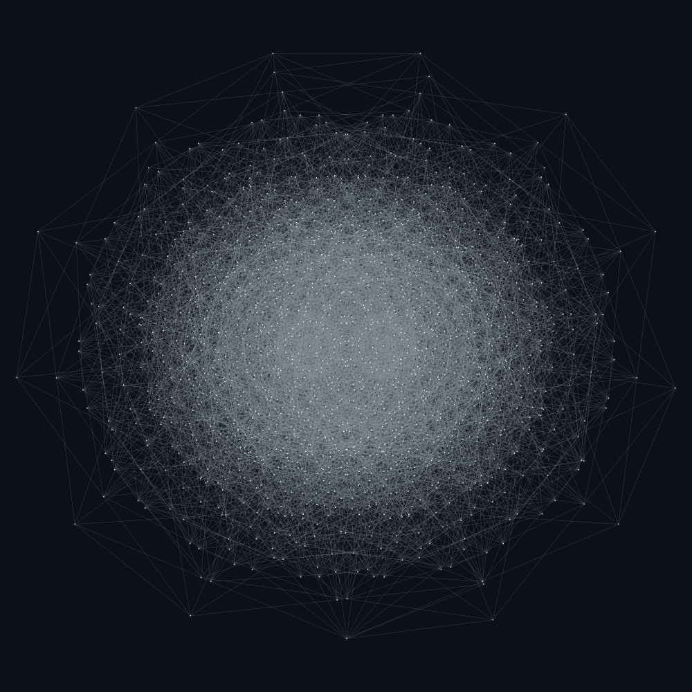
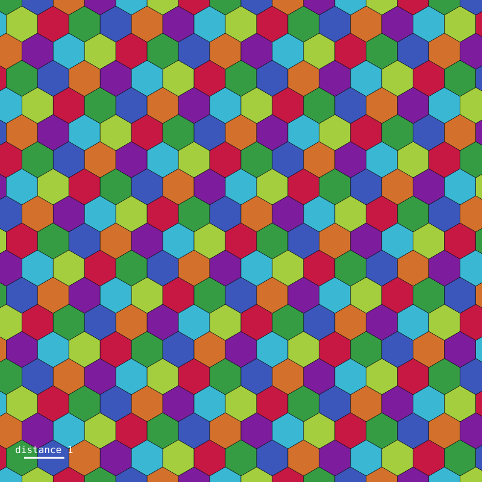
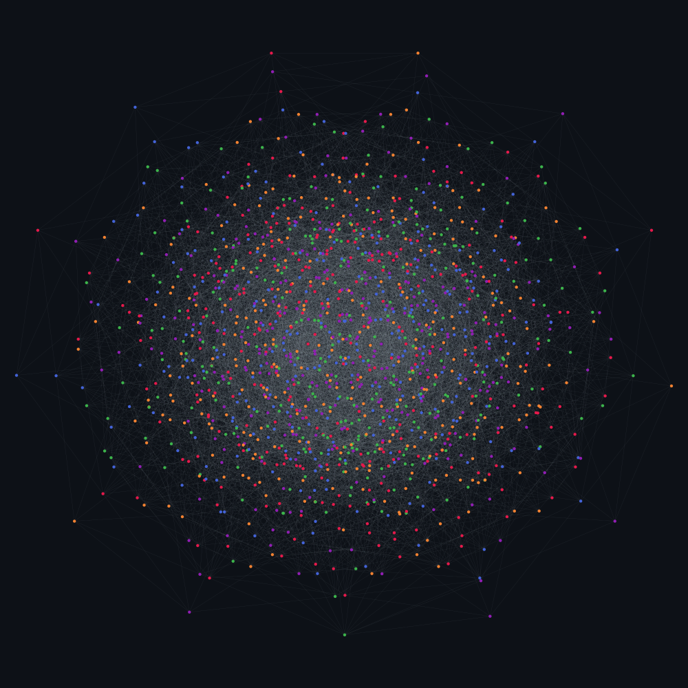

# Hadwiger–Nelson: machine-checked bounds on the chromatic number of the plane

> **The Hadwiger–Nelson problem is open.** It was posed in 1950 and nobody has solved it,
> including this repository. What is known is
>
> <p align="center"><b>5 &nbsp;≤&nbsp; χ(ℝ²) &nbsp;≤&nbsp; 7</b></p>
>
> and both of those bounds are re-derived here from scratch, in exact arithmetic, with no
> numbers taken on faith from the literature.

**The question.** Colour every point of the plane. How few colours suffice so that no two
points at distance exactly 1 ever get the same colour? That number is the *chromatic number
of the plane*, χ(ℝ²), also written CNP. Edward Nelson asked it in 1950. The answer is one of
5, 6 or 7; until de Grey's 2018 breakthrough, 4 was still in the running too.

**What is actually in this repo.** Three things, each verified rather than asserted:

| Result | Witness | Status here |
| --- | --- | --- |
| χ(ℝ²) ≥ 4 | Moser spindle (7 vertices), Golomb graph (10 vertices) | proved by exhaustive backtracking |
| χ(ℝ²) ≥ 5 | de Grey's graph *G* (1581 vertices, 7877 edges) | graph rebuilt from the published recipe, every edge certified at exactly unit length, non-4-colourability refuted by SAT and the refutation re-checked by `drat-trim` |
| χ(ℝ²) ≤ 7 | Isbell's hexagonal 7-colouring | proved by exact rational inequalities, plus a randomised cross-check |

Nothing here is new mathematics. What it is, is an independent, self-contained,
floating-point-free reconstruction: the de Grey graph is *rebuilt* from the 39 published
seed points and the sequence of rotations, not downloaded as a vertex list.

<p align="center">
  
  
</p>
<p align="center"><i>Left: the 1581-vertex graph that forces a fifth colour. Right: the tiling that never needs an eighth.</i></p>

## Verification log

These are the runs that produced the claims above, on 4 cores.

| Check | Method | Outcome |
| --- | --- | --- |
| *G* has 1581 vertices, 7877 edges | exact construction + certified edge detection | matches de Grey (2018) |
| every edge of *G* has length exactly 1 | rational arithmetic in K | 7877/7877 |
| no unit-distance pair of *G* was missed | modular filter is false-negative-free, cross-checked against a naive float scan | agree exactly |
| *G* is 5-colourable | CaDiCaL 1.9.5 | SAT in 0.03 s, colouring re-verified proper |
| *G* is **not** 4-colourable | CaDiCaL 1.9.5 via python-sat | **UNSAT in 699 s** |
| *G* is **not** 4-colourable | Kissat 4.0.4, default | **UNSAT**, independent confirmation |
| *G* is **not** 4-colourable | Kissat 4.0.4 `--unsat`, DRAT logging | **UNSAT in 645 s**, 1.2 GB certificate |
| that refutation is correct | **drat-trim**, 283 s | **`s VERIFIED`** |
| Isbell certificate | exact rational inequalities | valid, margins 0.900 and 1.162 |
| 7-colouring vs. random unit-distance pairs | 200 000 samples | 0 monochromatic |

Three separate solver configurations agree that no 4-colouring exists, and — more to the
point — the refutation has been re-checked by an independent proof checker, which replays
every inference and trusts nothing the solver claimed:

```
c 34822 of 42578 clauses in core
c 1993039 of 12265358 lemmas in core using 130520349 resolution steps
c 0 RAT lemmas in core; 2468679 redundant literals in core lemmas
s VERIFIED
```

So the lower bound here does not rest on "a SAT solver said UNSAT". It rests on 130 million
resolution steps that a separate program checked one at a time. Reproduce it with
`scripts/verify_lower_bound.sh`.

The 5-colouring below shows the graph is not doing anything more exotic than that:
χ(G) = 5 exactly.

<p align="center">
  
</p>
<p align="center"><i>An explicit proper 5-colouring of G, found by SAT and re-verified edge by edge. Four colours are impossible.</i></p>

## Quick start

```bash
pip install -r requirements.txt

python -m hadwiger_nelson upper-bound     # seconds
python -m hadwiger_nelson lower-bound     # the 4-colourability SAT call dominates
python -m hadwiger_nelson report          # both, end to end
```

Inspect or export a single graph:

```bash
python -m hadwiger_nelson graph spindle --chromatic
python -m hadwiger_nelson graph degrey --dimacs degrey.col --cnf degrey4.cnf -k 4
python -m hadwiger_nelson render
```

Run the tests (the de Grey UNSAT call is opt-in because it is slow):

```bash
pytest                # fast suite, ~5 s
pytest --run-slow     # includes the 4-colourability proof, ~12 min
```

For the strongest form of the lower bound — a refutation replayed by an independent proof
checker rather than believed on the solver's word — use:

```bash
scripts/verify_lower_bound.sh     # needs kissat and drat-trim on PATH
```

## Why the arithmetic is exact

The usual way to build a unit-distance graph is to compute coordinates as floats and call
two points adjacent when their distance is within some ε of 1. That is a guess, not a proof:
it can invent edges that are not there and miss edges that are.

Every coordinate in these constructions happens to live in one fixed number field:

* the triangular lattice and de Grey's seed set need √3 and √11 (and √33 = √3·√11),
* the rotation by 2·arcsin(1/4) has (cos, sin) = (7/8, √15/8), which brings in √5,
* the rotations by π/2 ± arcsin(1/8) have (cos, sin) = (∓1/8, 3√7/8), which brings in √7.

So everything lives in **K = ℚ(√3, √5, √7, √11)**. Because 3, 5, 7, 11 are distinct primes,
the 16 products √(∏T) over subsets T ⊆ {3,5,7,11} are a ℚ-basis of K. An element of K is
therefore a *unique* vector of 16 rationals, and `x == y` is decided by comparing
integers — no tolerances anywhere. `hadwiger_nelson/field.py` implements this.

### Finding the edges without floating point, and without checking 1.25M pairs slowly

1581 vertices means 1,249,490 pairs, and an exact squared distance in K costs a few hundred
rational multiplications. Doing that directly is slow, so edge detection is two-stage
(`geometry.py`):

1. **Modular filter.** Pick a prime *p* — here 1 000 000 931 — for which 3, 5, 7 and 11 are
   all quadratic residues, choose square roots mod *p*, and reduce every coordinate through
   the resulting ring homomorphism K → 𝔽ₚ. Keep the pairs whose squared distance is 1 in 𝔽ₚ.
   This step is vectorised with numpy over int64.
2. **Exact re-check.** Verify each surviving pair in K with rational arithmetic.

The soundness argument is the important part: a ring homomorphism sends 0 to 0, so if
‖u−v‖² − 1 is genuinely zero in K then it is zero mod *p* too. **Stage 1 therefore cannot
discard a real edge** — it has no false negatives, only (rare) false positives, and stage 2
removes those. The two stages together compute the edge set exactly. On the de Grey graph
the filter proposed 7877 pairs and all 7877 survived the exact check.

For extra assurance, `tests/test_graphs.py` also recomputes the edge set the naive
floating-point way and asserts the two agree exactly.

## The lower bound, χ(ℝ²) ≥ 5

`graphs.py` follows de Grey's recipe (arXiv:1804.02385, §5) literally:

1. the 39-point seed set *S*, transcribed from the paper;
2. close *S* under the order-12 dihedral group (60° rotations and reflection in the *x*-axis)
   to get *Sₐ*;
3. rotate *Sₐ* by 2·arcsin(1/4) to get *S_b*;
4. *Y* = *Sₐ* ∪ *S_b* with the two points (±1/3, 0) deleted;
5. rotate *Y* about (−2, 0) by π/2 + arcsin(1/8) to get *Yₐ*;
6. rotate *Y* about (−2, 0) by π/2 − arcsin(1/8) to get *Y_b*;
7. *G* = *Yₐ* ∪ *Y_b*.

Every intermediate count matches the paper on the nose, which is a strong signal that the
transcription is right:

| stage | this repo | de Grey (2018) |
| --- | --- | --- |
| \|S\| | 39 | 39 |
| \|Sₐ\| | 397 | 397 |
| \|G\| | 1581 | 1581 |
| edges of G | 7877 | 7877 |

Then `coloring.py` encodes "*G* has a proper 4-colouring" as SAT (6324 variables, 42 578
clauses) and the solver reports UNSAT. Since *G* is a unit-distance graph, any colouring of
the plane restricts to a colouring of *G*, so 4 colours cannot suffice for the plane.

Two optional constraint groups are added to help the solver; both are argued sound in the
source. *At-most-one* clauses forbid a vertex holding two colours, which no proper colouring
does anyway. *Symmetry breaking* pins a triangle to colours 0, 1, 2, which is legitimate
because colours are interchangeable — note that a unit-distance graph contains no K₄, so the
largest clique available is a triangle and only three of the four colours can be pinned.

### Independently checkable proofs

`--proof out.drat` makes the solver emit a DRAT certificate of the UNSAT result. CaDiCaL's
python-sat binding cannot log proofs, so requesting one switches to Glucose automatically.
The certificates are real: `drat-trim` reports `s VERIFIED` on the Moser spindle and Golomb
graph 3-colourability refutations.

For the 1581-vertex instance the practical route is to export the CNF and drive a
proof-logging solver directly, which is what `scripts/verify_lower_bound.sh` automates:

```bash
python -m hadwiger_nelson graph degrey --cnf degrey4.cnf -k 4
kissat --unsat degrey4.cnf degrey4.drat     # or: cadical degrey4.cnf degrey4.drat
drat-trim degrey4.cnf degrey4.drat          # -> s VERIFIED
```

The certificate is about 1.2 GB and takes roughly 11 minutes to produce and 5 to check.
Note that drat-trim reported `0 RAT lemmas`, so the proof is in fact a reverse unit
propagation refutation — the weakest and easiest-to-trust rule in the DRAT family.

## The upper bound, χ(ℝ²) ≤ 7

Tile the plane with the Voronoi cells of a triangular lattice of spacing *s*; the cells are
regular hexagons of circumradius *r* = *s*/√3. Identify the lattice with the Eisenstein
integers ℤ[ω], ω = e^{iπ/3}, and colour a cell by the residue of its centre modulo the ideal
generated by π = 1 + 2ω, whose norm is 7. Concretely, since 3 is a root of *t*² − *t* + 1
mod 7, the colour of the cell at *a* + *bω* is (*a* + 3*b*) mod 7.

Two points of the same colour lie either in one cell, at distance at most the diameter 2*r*,
or in different cells whose centres differ by a nonzero element of the ideal, hence are at
least *s*√7 apart, leaving the points at least *s*√7 − 2*r* = *r*(√21 − 2) apart. Distance
exactly 1 is impossible as soon as

<p align="center"><b>2r &lt; 1 &lt; r(√21 − 2)</b>, i.e. <b>1/(√21 − 2) ≈ 0.3873 &lt; r &lt; 0.5</b>.</p>

`upper_bound.py` takes *r* = 9/20 and checks both inequalities **exactly**: squaring the
positive inequality √21·*r* > 1 + 2*r* turns it into 21*r*² > (1 + 2*r*)², which is a
comparison of rationals, 1701/400 > 361/100. The claim that the colour sublattice has
shortest vector of norm 7 is verified by direct enumeration of the quadratic form
*a*² + *ab* + *b*². The margins are comfortable: cells have diameter 0.900, and same-coloured
points are at least 1.162 apart.

A randomised test then samples unit-distance pairs and confirms that none is monochromatic.
That test is a sanity check on the implementation, not part of the proof — the proof is the
pair of rational inequalities.

## Layout

```
hadwiger_nelson/
  field.py        exact arithmetic in Q(sqrt3, sqrt5, sqrt7, sqrt11)
  geometry.py     points, rotations, certified unit-distance edge detection
  graphs.py       hexagon H, Moser spindle, Golomb graph, de Grey's G
  coloring.py     backtracking + SAT colourability, DIMACS/CNF export
  upper_bound.py  Isbell's 7-colouring and its exact certificate
  render.py       SVG output
  cli.py          command line interface
tests/            pytest suite; the slow UNSAT check is behind --run-slow
```

## What would actually solve the problem

For the record, since the title of this repo promises less than it might appear to:

* **To prove χ(ℝ²) ≥ 6** you would exhibit a finite unit-distance graph with chromatic
  number 6. None is known, and Polymath16 spent considerable effort looking. The machinery
  here would verify one immediately if you had it — feed the vertices to
  `unit_distance_edges` and the graph to `sat_k_colorable`.
* **To prove χ(ℝ²) ≤ 6** you would exhibit a 6-colouring of the whole plane avoiding
  distance 1. None is known, and two older theorems constrain what one could look like.
  If every colour class is a region — a *map* colouring, of which Isbell's tiling is one —
  then five colours provably fail, so map colourings need 6 or 7 (Woodall 1973; a gap in the
  proof was found and repaired by Townsend 1981). And Falconer proved in 1981 that four
  *measurable* colour classes never suffice, so the measurable chromatic number is at least
  5 — a measurable analogue of de Grey's bound, 37 years earlier.
* **The 5 side is not obviously tight either.** de Grey's graph shows only that 4 fails.
  Whether the true value is 5, 6 or 7 is exactly as open as it was in 1950.

## References

* E. Nelson (1950), as recounted in A. Soifer, *The Mathematical Coloring Book*, Springer 2009.
* L. Moser and W. Moser, *Solution to problem 10*, Canad. Math. Bull. 4 (1961) 187–189 — the spindle.
* J. Isbell, in Soifer op. cit. — the hexagonal 7-colouring.
* S. Golomb, in Soifer op. cit. — the 10-vertex graph.
* A. D. N. J. de Grey, *The chromatic number of the plane is at least 5*, Geombinatorics 28 (2018) 18–31, [arXiv:1804.02385](https://arxiv.org/abs/1804.02385).
* M. Heule, *Computing small unit-distance graphs with chromatic number 5*, [arXiv:1805.12181](https://arxiv.org/abs/1805.12181) — smaller witnesses, down to 510 vertices.
* D. R. Woodall, *Distances realized by sets covering the plane*, JCTA 14 (1973) 187–200, and S. P. Townsend, *Every 5-coloured map in the plane contains a monochrome unit*, JCTA 30 (1981) 114–115 — map-type colourings need at least 6.
* K. Falconer, *The realization of distances in measurable subsets covering R^n*, JCTA 31 (1981) 184–189 — measurable colourings need at least 5.
* [Polymath16](https://michaelnielsen.org/polymath/index.php?title=Hadwiger-Nelson_problem), the follow-up collaborative project.
