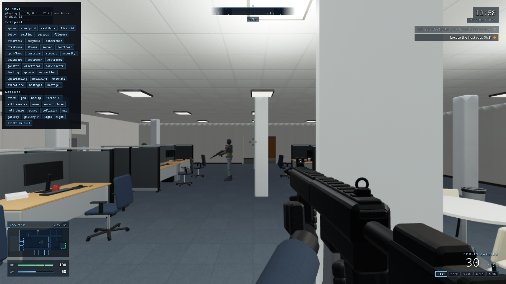

# NORTHSTAR RESCUE

A single-player tactical first-person shooter set in a snowbound corporate
headquarters. You are a lone tactical response operator: infiltrate the
**Northstar Administrative Center**, locate and secure two hostages, escort
them to the fleet garage, and hold for extraction.

Original vertical slice — all code, art, audio and content are generated
procedurally in this repository. No engine editors, no external assets,
no copyrighted material (and nothing from Counter-Strike/Valve).



## Run it

```bash
npm install
npm run dev        # -> http://127.0.0.1:5173 (Chromium-based browser recommended)
```

Production build: `npm run build && npm run preview` (http://127.0.0.1:4173).

## Controls

| Input | Action |
| --- | --- |
| W A S D | Move |
| Mouse | Look (click once to capture the mouse) |
| Left mouse | Fire |
| Right mouse | Aim down sights (scope on the LR-7) |
| Shift | Walk quietly |
| C / Ctrl | Crouch |
| Space | Jump |
| R | Reload |
| E | Interact: doors, hostages (secure / hold / follow), pickups, dock panel |
| 1–5 / wheel | Weapon slots: primary, sidearm, knife, flash, smoke |
| F | Toggle fullscreen |
| Esc / P | Pause |

## Mission

1. Cross the snowbound courtyard and enter through the security vestibule.
2. Locate both hostages (conference room and executive suite — intel is
   approximate; hostile patrols react to sight and sound).
3. Secure each hostage with E; they follow you (E again to hold position).
4. Escort them to the extraction garage on the east side.
5. Activate the dock master panel, then hold the garage against the
   reinforcement wave until the evac window opens.

Difficulty (Recruit / Operative / Veteran) scales enemy count, perception,
accuracy, damage, starting armor and the mission clock.

## Testing & QA

```bash
npm test               # Playwright suite (52 scenarios), runs headless
npm run shots          # screenshot matrix across every room checkpoint
node tools/playthrough.mjs   # scripted full-mission audit run (victory check)
npm run manifest       # regenerate docs/asset-manifest.md from the registry
```

Deterministic hooks (always installed): `window.render_game_to_text()`
returns a JSON snapshot of player/mission/AI/door state;
`window.advanceTime(ms)` steps the fixed 60 Hz simulation deterministically.
A development QA mode (`http://127.0.0.1:5173/?qa=1`) adds teleports, an
asset gallery, AI freeze, lighting scenarios, collision/nav views and more
via the on-screen panel or `window.__qa`.

## Architecture (locked stack)

- **Three.js (WebGL2)** rendering on a single canvas; DOM overlay UI.
- **Vanilla ES modules** via Vite; no game engine, no editor.
- **Fixed-timestep simulation** (60 Hz) with seeded RNG for determinism.
- **Custom AABB collision** (axis-separated movement + step-up for stairs).
- **Baked navigation grid** (0.45 m cells, door-aware) + A* for enemies and
  hostage escort across both floors.
- **Procedural everything**: canvas-generated PBR textures, code-built
  furniture/characters/weapons, synthesized WebAudio SFX/music.
- Systems live in `src/`: `core/` (loop, input, settings, test hooks),
  `world/` (map compiler, doors, glass, collision, lighting, placement),
  `player/` (controller, weapons, viewmodel), `ai/` (enemies, hostages, nav),
  `game/` (mission, difficulty), `fx/`, `audio/`, `ui/`, `assets/`
  (materials, props, characters, weapon models, registry), `dev/` (QA).

See `progress.md`, `docs/ownership-ledger.md`, `docs/visual-bible.md`,
`docs/asset-manifest.md` and `docs/checklists.md` for the full coordination
record, and `docs/final-report.md` for deliverable checklists.

## Performance

Quality presets (Low/Medium/High/Ultra) scale shadow resolution, dynamic
light count and particle budgets; resolution scale is adjustable separately.
Static geometry is merged (~200–900 draw calls in busy views) and the sun
shadow map refreshes on a timer rather than every frame. Tested at 1920×1080.
