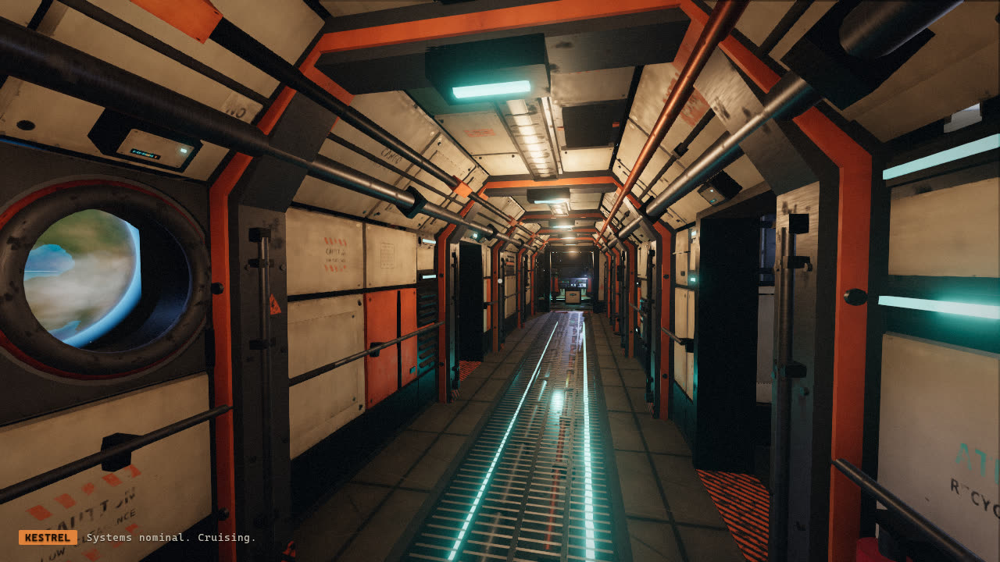
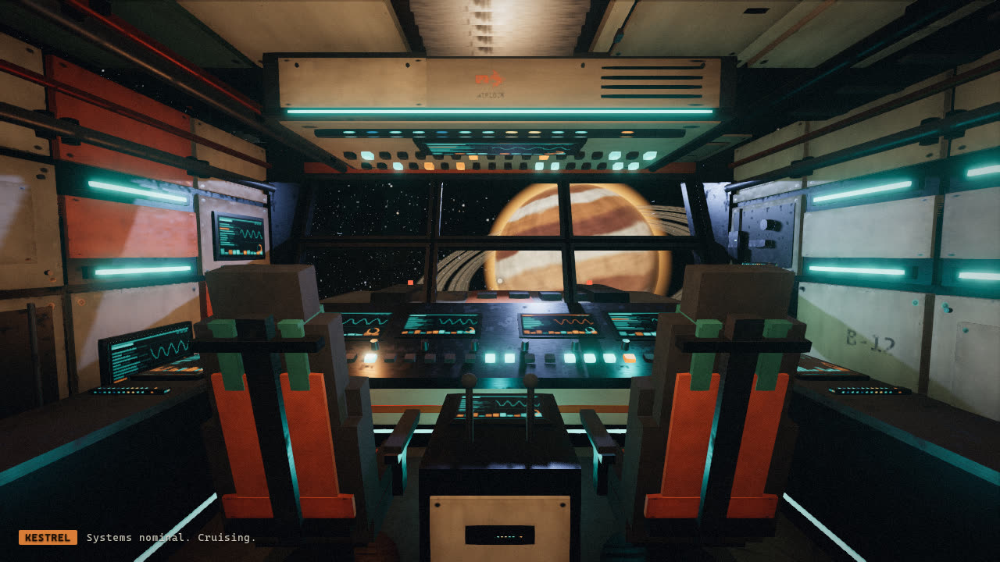
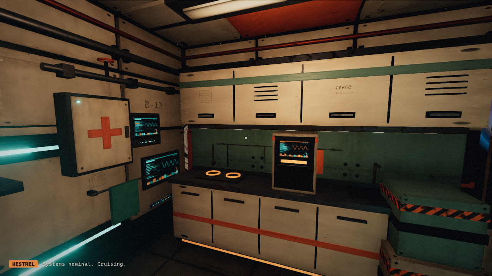
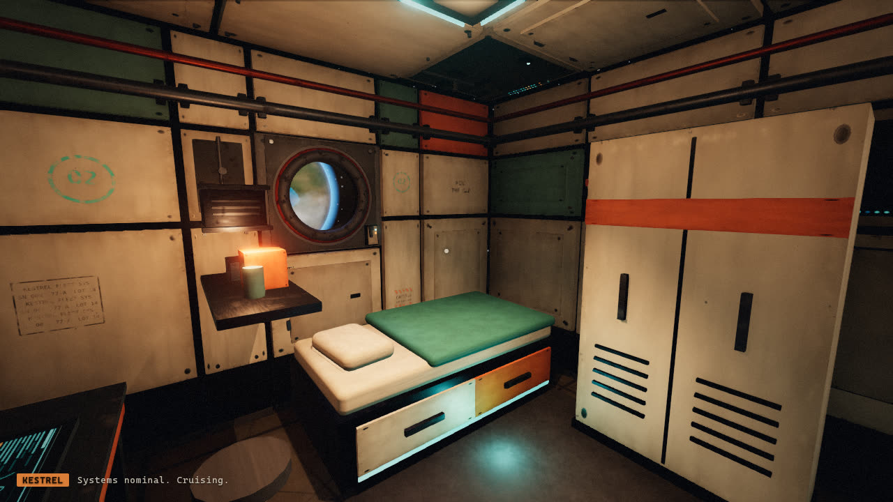

# Baseline: the ship before the Star Destroyer conversion

Captured from commit `ad51178` (branch `cursor/spaceship-interior-demo-ad4e`) with the existing harness,
`node tools/shots.mjs sd0_baseline`, on the build machine (4 vCPU, software WebGL via SwiftShader, so
frame times below are CPU-rasterised and only the counts are transferable to real GPUs).

## What exists

- A 16 m freighter interior: corridor, cockpit, crew quarters, galley, refresher; five rooms, one deck.
- Systems: first-person controller with capsule/AABB collision (`src/player.js`), kit-bash builder that
  merges primitives per material (`src/kit.js`), fully procedural textures and PBR material families
  (`src/textures.js`, `src/materials.js`), starfield / planets / nebulae (`src/space.js`), rest-cycle
  lighting controller, raycast interactions (sleep / eat / wash), post stack (ACES, n8ao, bloom, vignette,
  grain, shadow lift), adaptive resolution scaler, HUD, deterministic screenshot harness with drift and
  interaction checks (`tools/shots.mjs`).
- No exterior model, no camera modes other than first person, no doors, lifts, or vertical movement,
  no LOD or instancing, no perf counters beyond draw calls / triangles / frame time.

## Measurements

| View | Draw calls | Triangles |
| --- | --- | --- |
| cockpit | 112 | 249 606 |
| corridor | 124 | 226 260 |
| quarters | 113 | 226 166 |
| window | 116 | 251 372 |
| windshield | 110 | 249 484 |
| galley | 119 | 249 646 |
| bathroom | 171 | 343 238 |
| aft | 161 | 365 954 |

Scene totals: 70 geometries, 78 textures, 49 shader programs, 22 lights (all always on), 69 colliders.
Bundle: 908 KB JS (307 KB gzip). Ready-to-first-frame on the build machine: ~13 s (software GL,
dominated by procedural texture generation and shader compilation); the same page on a laptop GPU
during the previous phase was ~2 s.

Interactions still pass (`bed`, `galley`, `bathroom` prompts and status text), sky drift check passes
(sky moves, interior pixels unchanged).

## Reference frames

Full-resolution PNGs and `results.json` are in `shots/iter_sd0_baseline/` (not committed; regenerate with
the harness).
